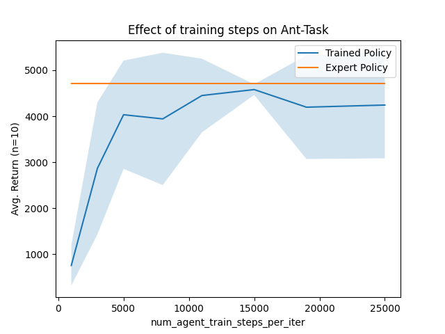
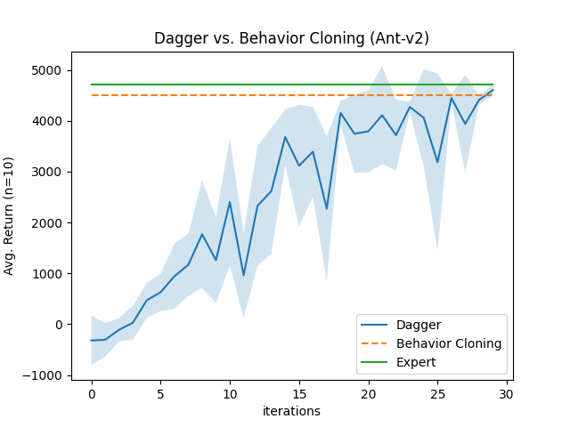
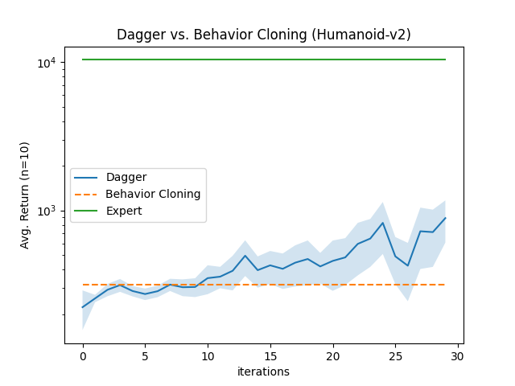

# Homework 1: Results

## Question 1

|     | Ant-v2 | Humanoid-v2 |
| --- | --- | --- |
| Return (mean/std) | 4511.08 ± 104.08 |  314.82 ±  61.16 |
| Expert Normalized Return | 95.68% | 3.04%  |

*Table 1:* Restults for *Ant-v2* and *Humanoid-v2*. 

Both policies were trained with the same hyperparameter configuration
(see [bc_ant.yml](part1/bc_ant.yml) and [bc_humanoid.yml](part1/bc_humanoid.yml)) and evaluated over 10 episodes.

*Figure 1:* After experimenting with various configurations for batch size and model architecture, I figured out that
increasing the update rate of the policy per iteration had a drastic impact on the performance. This is especially true
for higher batch sizes, while for smaller batch sizes, more iterations can have a negative impact due to overfitting. 
Hyperparameters for this plot can be found in [bc_ant_iterations.yml](part1/bc_ant_iterations.yml).

## Question 2

The figures above show the performance of the Dagger policy compared to pure behavior cloning and the expert's performance.
Dagger was trained with the same hyperparameters for 30 iterations for both tasks. The amount of gradient steps and the
batch size for Dagger were set to match the quantities of the behavior cloning experiment after 30 iterations. This allows
to compare the performance of the two approaches.

The results show that Dagger helps to improve the quality of the policy. For the Ant task, Dagger roughly matches the BC
policy after 30 iterations, which already matched the expert's performance. Compared to pure BC, 
Dagger was able to improve the average return for the Humanoid task by a factor of 3 when using the same amount of gradient steps and data, compared to pure BC.