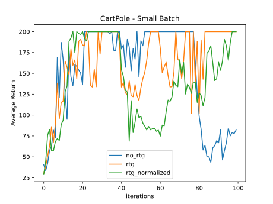
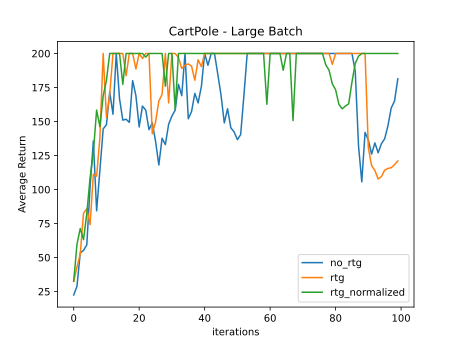

# Homework 2: Results

## Experiment 1: CartPole





Comparing reward-to-go and trajectory-centric value estimators, the former yields slightly better results, especially for
larger batches. Trajectory-centric value estimators seem to be more unstable. However, both suffer from sudden drops in 
performance at the end of the training.

Advantage standardization helped stabilizing training and reduced drastic performance collapses, especially when combined
with larger batch sizes. In general, larger batch sizes also significantly improved stability.

## Experiment 2: InvertedPendulum

The largest learning rate and the smallest batch that achieved were:
- batch_size: 150
- learning_rate: 0.03

The exact command line configuration was
```shell
python cs285/scripts/run_hw2.py --env_name InvertedPendulum-v2 \
--ep_len 1000 --discount 0.9 -n 100 -l 2 -s 64 -b 150 -lr 0.03 -rtg \
--exp_name q2_b150_r0.03
```

## Experiment 3: LunarLander