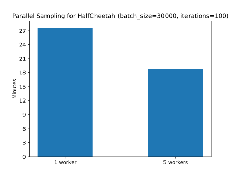

# Homework 2: Results

## Experiment 1: CartPole


Comparing reward-to-go and trajectory-centric value estimators, the former yields slightly better results, especially for
larger batches. Trajectory-centric value estimators seem to be more unstable. However, both suffer from sudden drops in 
performance at the end of the training.

Advantage standardization helped stabilizing training and reduced drastic performance collapses, especially when combined
with larger batch sizes. In general, larger batch sizes also significantly improved stability.

## Experiment 2: InvertedPendulum

The largest learning rate and the smallest batch that achieved were:
- batch_size: 150
- learning_rate: 0.03

The exact command line configuration was
```shell
python cs285/scripts/run_hw2.py --env_name InvertedPendulum-v2 \
--ep_len 1000 --discount 0.9 -n 100 -l 2 -s 64 -b 150 -lr 0.03 -rtg \
--exp_name q2_b150_r0.03
```

## Experiment 3: LunarLander


## Experiment 4: HalfCheetah


Higher learning rates significantly speed up the training process. The blue, red and pink curve depict the learning curves
for the lowest learning rates over all batch sizes and are amongst the worst performing ones. Higher learning rates also
increase the variance of the training process and to potentially catastrophic drops in performance. Increasing the batch
size reduced the variance and leads to smoother learning curves.


# Experiment 5: HopperV2


Lambda values closer to 1.0 lead to better performance than a lambda value of zero, which had multiple performance collapses.
The best performance was achieved  with `lambda=0.95`, however, higher values yield more stable learning curves.

# Bonus

I implemented parallel data sampling which resulted in much better training times. In the figure below, the training durations
for the HalfCheetah grid search from *Experiment 4* are shown. In this experiment, parallelizing the sampling over 5 worker
threads reduced the training time from 28 minutes to 18 minutes.

