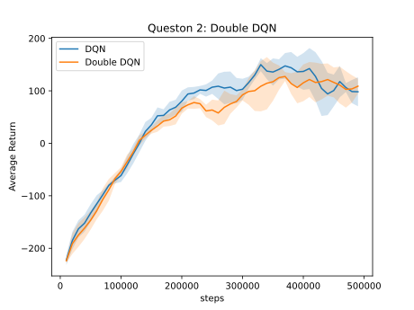
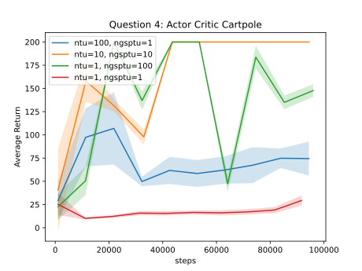

# Homework 3: Results

## Question 1: basic Q-learning performance (DQN)

## Question 2: double Q-learning (DDQN)

## Question 4: Sanity check with Cartpole

The figure suggests that a balanced number of target and gradient updates yields better results than imbalanced ones.