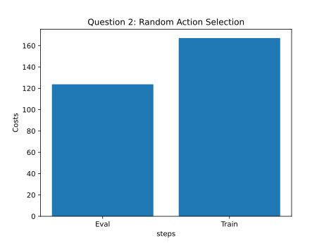

# Homework 4: Results

## Problem 1: Model Learning

Figure 1: Losses of different model architectures

Figure 2: Model Predictions of the 2x32 architecture.

Figure 3: Model Predictions of the 2x250 architecture.

## Problem 2: Random Action Selection

## Problem 3: Iterative Model Learning

## Problem 5: Random Shooting vs. CEM

